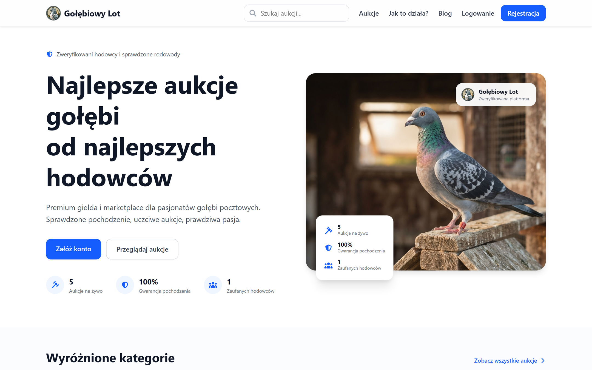
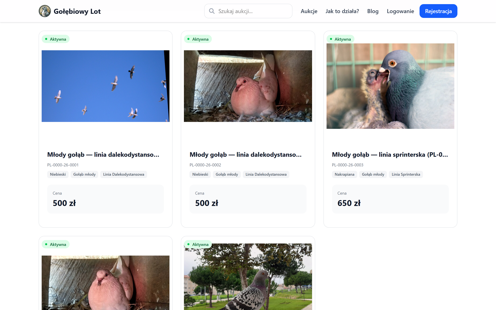
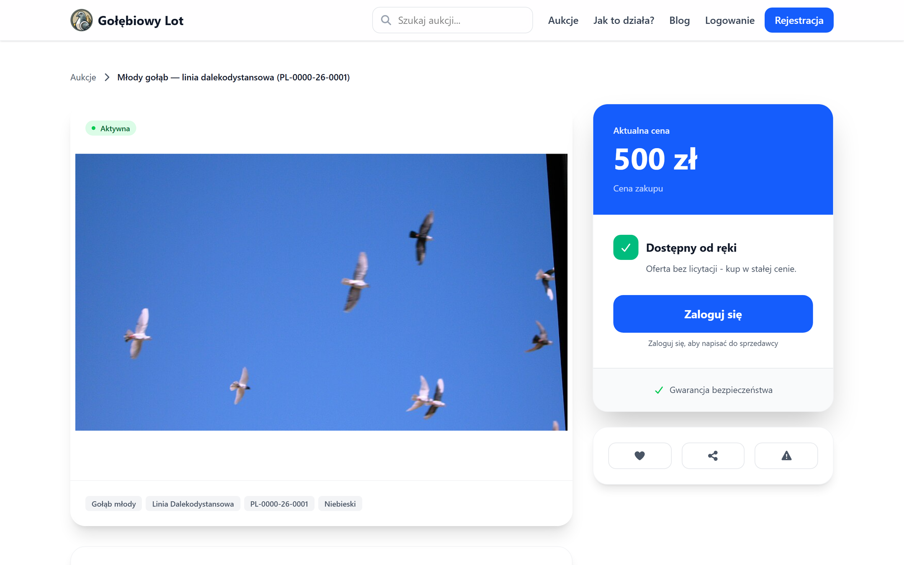
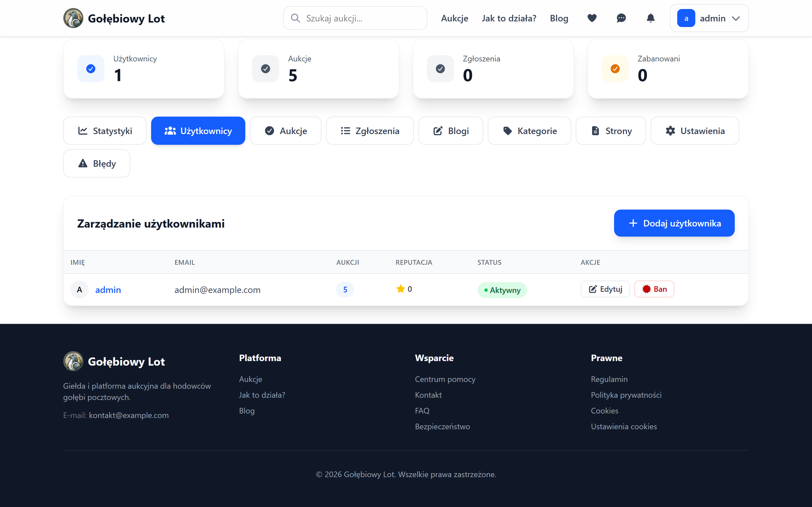
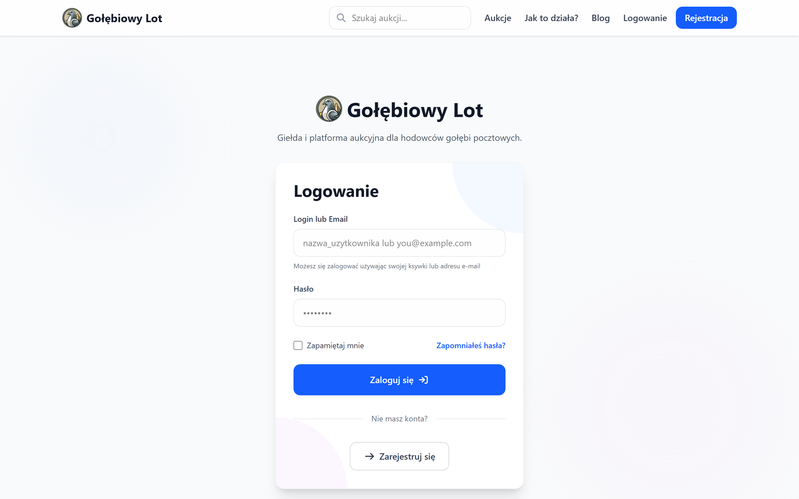

# Pigeon Flight

An auction platform for racing-pigeon breeders: timed auctions with anti-sniping,
automatic bidding, "buy now" offers, breeder profiles with reputation, direct
messages between buyers and sellers, and a full administration panel.

It ran in production as **Gołębiowy Lot** at golebiowylot.pl from July to August
2026, serving real breeders. The server has since been shut down, so the domain
no longer answers — what follows describes the application, which runs anywhere
it is installed.

> The platform was built for a Polish audience, so its interface is in Polish.
> The code is English throughout: names, comments, the database schema and the
> API.



---

## Contents

- [What it does](#what-it-does)
- [Screenshots](#screenshots)
- [How it is built](#how-it-is-built)
- [Running it](#running-it)
- [Testing](#testing)
- [Layout](#layout)
- [Licence](#licence)

---

## What it does

### Auctions

- **Timed auctions and fixed-price offers.** A lot can be bid on, bought
  outright, or both at once.
- **Anti-sniping.** A bid placed in the last moments extends the auction, so an
  auction cannot be won by being fastest rather than highest.
- **Automatic bidding.** A bidder sets a ceiling and the platform bids on their
  behalf, by the smallest step that keeps them ahead.
- **Categories, search and sorting** by price, ending time and number of bids.

### People

- **Breeder profiles with reputation** built from completed transactions.
- **Direct messages** between buyers and sellers, with the option to block
  somebody.
- **Reports of abuse** that ban an account automatically once a threshold of
  distinct reports is crossed, so obvious cases do not wait for a moderator.

### Accounts

- Registration with email verification, password reset.
- **Two-factor authentication** (TOTP, via Google2FA).
- Roles and permissions (spatie/laravel-permission).
- OAuth sign-in prepared through Laravel Socialite.

### Real time

Bids, outbid notices and messages arrive over WebSockets (Laravel Reverb), with
**web push** notifications for what happens while the tab is closed.

### Administration

Users, auctions, reports, blog, categories, static pages and platform settings —
limits, notifications, SEO, a maintenance mode and system-wide announcements —
are all editable without a deployment.

---

## Screenshots

|                                                 |                                                   |
| ----------------------------------------------- | ------------------------------------------------- |
|         |  |
| Browsing the listings, with filters and sorting | One listing, with the seller and the price        |
|      |            |
| The administration panel                        | Signing in                                        |

Taken from a running instance with zapisano home.png
zapisano auctions.png
zapisano login.png
zapisano auction-detail.png
zapisano admin.png, so they go
stale the moment the interface does.

---

## How it is built

**Backend** — PHP 8.2, Laravel 12, MySQL 8, Laravel Sanctum for API tokens,
Laravel Reverb for WebSockets, `minishlink/web-push`, `intervention/image`,
`spatie/laravel-permission`, Google2FA.

**Frontend** — Vue 3 with the Composition API and `<script setup>`, Vite, Pinia,
Vue Router, Tailwind CSS.

**Quality** — Laravel Pint and PHPStan/Larastan on the backend, ESLint and
Prettier on the frontend, and three independent layers of tests.

The frontend is a separate single-page application in `src/`, talking to the
backend only over the API in `routes/api.php`. Nothing is rendered by Blade for
the application itself, so the two halves could be deployed apart.

---

## Running it

Requirements: PHP 8.2 with the extensions Laravel 12 needs, Composer, Node.js 18
or newer, and MySQL 8. The test suite runs on SQLite and needs no server.

```bash
cp .env.example .env
composer install
php artisan key:generate
npm install && npm run build

mysql -u root -e "CREATE DATABASE IF NOT EXISTS pigeon_auction   CHARACTER SET utf8mb4 COLLATE utf8mb4_unicode_ci;"
php artisan migrate

SEED_ADMIN_PASSWORD="choose one" php artisan db:seed
```

Then:

```bash
php artisan serve    # http://localhost:8000
```

Laravel serves the console and the API from the same origin, so that is the
whole of it. While working on the interface, `npm run dev` replaces the built
assets with hot reloading.

Two settings are worth naming. `.env` holds the operator of the instance — the
terms of service and the privacy notice have to name somebody real — and
**seeding refuses to run without `SEED_ADMIN_PASSWORD`**, so that no
installation ever starts with an administrator whose password is written down
in this repository.

---

## Testing

Eighty test files across three layers, each run on its own: 49 PHPUnit, 18
Vitest and 13 Playwright.

```bash
php artisan test     # PHPUnit — feature tests over the API
npm run test:unit    # Vitest — Vue components
npm run test:e2e     # Playwright — a real browser against a real backend
```

The end-to-end suite needs both servers running; it signs in, places bids and
checks what the other side sees, rather than mocking the API away.

Static analysis and formatting:

```bash
vendor/bin/pint --test        # PHP formatting
vendor/bin/phpstan analyse    # PHP static analysis
npm run lint                  # ESLint
```

---

## Layout

```
app/                  backend: controllers, models, services, jobs, events
routes/api.php        every endpoint the frontend calls
database/migrations/  schema history
src/                  the Vue application: pages, components, stores, composables
tests/Feature/        PHPUnit feature tests over the API
tests/Unit/           PHPUnit unit tests
resources/js/tests/   Vitest component and store tests
tests/e2e/            Playwright end-to-end tests
```

---

## Licence

This is a commercial project. The source is published so that it can be read and
reviewed; **all rights are reserved** and no permission to use, copy or
redistribute it is granted.
